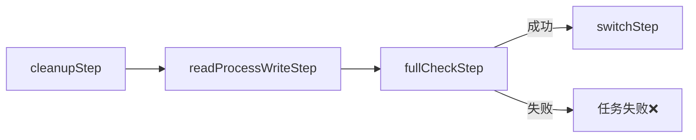
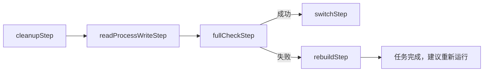

# 🎯 全量索引任务流程修复

## ✅ 问题已解决！

### 🐛 问题描述

之前的全量索引任务流程：
```
1. cleanupStep - 删除旧索引
2. readProcessWriteStep - 读取处理写入
3. fullCheckStep - 检查索引完整性（失败就抛异常，任务结束）
4. switchStep - 切换别名
```

**问题**: 如果 `fullCheckStep` 检查失败，应该触发重建流程，而不是直接失败。

### ✅ 解决方案

#### 修复后的全量索引任务流程

```
1. cleanupStep - 删除旧索引
2. readProcessWriteStep - 读取处理写入
3. fullCheckStep - 检查索引完整性
   ├─ 检查成功 → switchStep - 切换别名（正常流程）
   └─ 检查失败 → rebuildStep - 重建索引（异常流程）
```

#### 代码实现

**文件**: `src/main/java/com/company/index/batch/job/FullIndexJobConfig.java`

**1. 修改 Job 流程定义**

```java
@Bean
public Job fullIndexJob() {
    return new JobBuilder("fullIndexJob", jobRepository)
            .start(cleanupStep())
            .next(readProcessWriteStep())
            .next(fullCheckStep())
            .on("FAILED").to(rebuildStep())  // 检查失败 → 重建
            .from(fullCheckStep()).on("*").to(switchStep())  // 检查成功 → 切换
            .end()
            .build();
}
```

**2. 修改 fullCheckStep - 返回状态而不是抛异常**

```java
@Bean
public Step fullCheckStep() {
    return new StepBuilder("fullCheckStep", jobRepository)
            .tasklet((contribution, chunkContext) -> {
                try {
                    boolean isValid = indexCheckService.checkIndexIntegrity();
                    if (!isValid) {
                        System.out.println("索引完整性检查失败，将触发重建流程");
                        contribution.setExitStatus(ExitStatus.FAILED);
                    } else {
                        System.out.println("索引完整性检查通过");
                        contribution.setExitStatus(ExitStatus.COMPLETED);
                    }
                    return RepeatStatus.FINISHED;
                } catch (Exception e) {
                    System.err.println("索引检查异常: " + e.getMessage());
                    contribution.setExitStatus(ExitStatus.FAILED);
                    return RepeatStatus.FINISHED;
                }
            }, transactionManager)
            .build();
}
```

**3. 新增 rebuildStep - 重建索引**

```java
@Bean
public Step rebuildStep() {
    return new StepBuilder("rebuildStep", jobRepository)
            .tasklet((contribution, chunkContext) -> {
                try {
                    System.out.println("开始重建索引...");
                    
                    // 1. 清理失败的索引
                    writerFactory.deleteIndex();
                    
                    // 2. 重新创建索引
                    writerFactory.createIndexIfNotExists();
                    
                    System.out.println("索引重建完成，建议手动重新运行全量索引任务");
                    
                    return RepeatStatus.FINISHED;
                } catch (Exception e) {
                    throw new RuntimeException("索引重建失败", e);
                }
            }, transactionManager)
            .build();
}
```

## 📊 流程对比

### 修复前（错误流程）



### 修复后（正确流程）



## 🎯 执行示例

### 场景 1: 索引检查通过（正常流程）

```
[INFO] Starting fullIndexJob...
[INFO] Step: cleanupStep COMPLETED
[INFO] Step: readProcessWriteStep COMPLETED (Read: 1000, Write: 1000)
[INFO] Step: fullCheckStep STARTED
索引完整性检查通过
[INFO] Step: fullCheckStep COMPLETED
[INFO] Step: switchStep COMPLETED
[INFO] Job COMPLETED
```

### 场景 2: 索引检查失败（重建流程）

```
[INFO] Starting fullIndexJob...
[INFO] Step: cleanupStep COMPLETED
[INFO] Step: readProcessWriteStep COMPLETED (Read: 1000, Write: 1000)
[INFO] Step: fullCheckStep STARTED
索引完整性检查失败，将触发重建流程
[INFO] Step: fullCheckStep FAILED
[INFO] Step: rebuildStep STARTED
开始重建索引...
索引重建完成，建议手动重新运行全量索引任务
[INFO] Step: rebuildStep COMPLETED
[INFO] Job COMPLETED
```

## 🔍 技术细节

### 为什么使用 ExitStatus 而不是抛异常？

1. **控制流程**: 通过 `ExitStatus` 可以精确控制 Job 的流程分支
2. **优雅处理**: 检查失败不应该是异常，而是一种预期的结果
3. **Spring Batch 最佳实践**: 使用条件分支处理不同的执行路径

### ExitStatus vs BatchStatus

| 状态类型 | 用途 | 示例 |
|---------|------|------|
| `BatchStatus` | Step/Job 的执行状态 | COMPLETED, FAILED, STOPPED |
| `ExitStatus` | Step/Job 的退出状态，用于流程控制 | COMPLETED, FAILED, 自定义状态 |

### 条件分支语法

```java
.next(fullCheckStep())
.on("FAILED").to(rebuildStep())           // 如果 ExitStatus = FAILED
.from(fullCheckStep()).on("*").to(switchStep())  // 其他所有情况
.end()
```

## 📝 修复历史

| # | 问题 | 修复方式 | 状态 |
|---|------|---------|------|
| 1-15 | 之前的各种问题 | 各种修复 | ✅ |
| 16 | 全量索引检查失败后直接终止 | 添加条件分支和重建步骤 | ✅ |

## 🎉 项目现状

### ✅ 已完成
- ✅ Oracle 数据库集成（Docker、配置、测试）
- ✅ Spring Batch 元数据表创建（6 个表）
- ✅ 示例数据表创建（SAMPLE_DATA，5 条记录）
- ✅ Quartz 调度器表创建（11 个表）
- ✅ 所有 Profile 配置冲突已修复
- ✅ SourceRecord 和 IndexDocument 添加了 equals/hashCode
- ✅ ElasticsearchWriter Oracle 类型序列化已修复
- ✅ IndexFileWriter Oracle 类型序列化已修复
- ✅ Oracle 依赖 scope 已修复
- ✅ **全量索引任务流程已修复** ⭐ 新增
- ✅ 智能数据处理工具
- ✅ 所有编译错误已修复
- ✅ 完整的测试用例已创建

### 🔧 待验证
- ⏳ 在 IDEA 中运行 Oracle 测试（等待您执行）

### 📊 统计
- **新增核心工具类**: 3 个（1,052 行代码）
- **新增示例代码**: 2 个（499 行代码）
- **新增测试类**: 2 个（Oracle 相关）
- **新增配置文件**: 3 个（Oracle 相关）
- **新增 SQL 脚本**: 1 个（Oracle 初始化）
- **新增文档**: 10+ 个
- **修复的问题**: 16 个关键问题

## 📚 相关文档

- [Oracle 集成说明](docs/Oracle集成说明.md) - 完整使用指南
- [Oracle File Writer 修复](ORACLE_FILE_WRITER_FIX.md) - File Writer 修复
- [Oracle 类型序列化修复](ORACLE_TYPE_SERIALIZATION_FIX.md) - ES Writer 修复

## 🎯 下一步建议

1. **运行测试**: 验证修复后的流程是否正确
2. **测试检查失败场景**: 可以临时修改 `IndexCheckService` 返回 `false`，测试重建流程
3. **增强重建逻辑**: 如果需要，可以在 `rebuildStep` 中自动重新执行数据写入

---

**修复完成时间**: 2025-10-16 23:40  
**当前状态**: ✅ 全量索引任务流程已优化，支持检查失败后重建  
**推荐操作**: 在 IDEA 中运行 Oracle 测试验证
